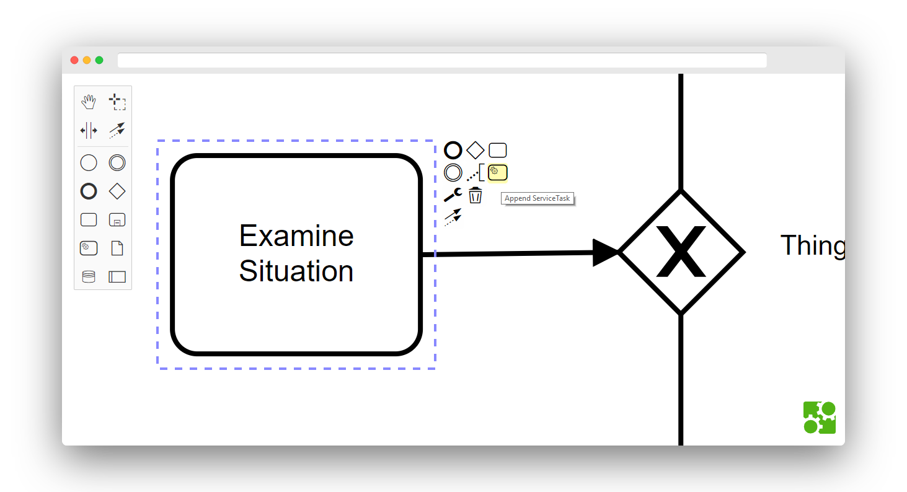
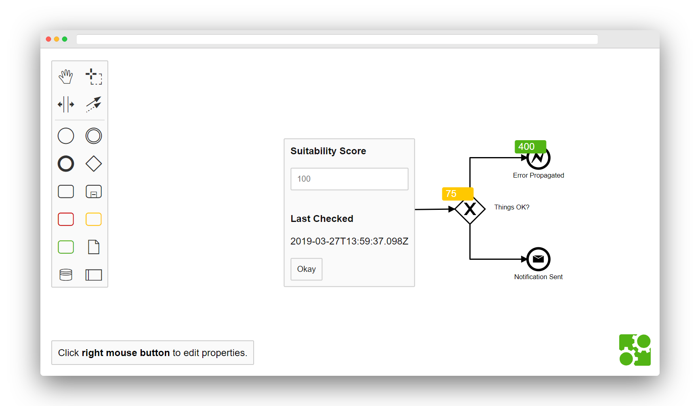

# Custom Elements in bpmn-js

An introduction to custom elements in [bpmn-js](https://github.com/bpmn-io/bpmn-js), their use cases and implementation approaches.

## Use Cases

You can use custom elements (meaning elements with extension attributes and elements) to add data to a diagram or diagram elements that is closely related to them or has a similar life cycle. Let's look at some examples:

* adding additional requirements to activities
* adding data related to performance analytics such as KPI targets
* adding notes
* adding technical information related to process execution

:notebook: If your data is not closely related to the diagram or diagram elements, has a different life cycle (e.g. runtime data) or is stored externally you wouldn't use custom elements. The same is true, if you want to access your data outside of the context of BPMN 2.0.

# Implementation Approaches

If you decide to use custom elements there are a couple of different approaches:

## Simple Approach: Using the `bpmn:Documentation` Element

A simple approach that doesn't require any changes in bpmn-js is using the `bpmn:Documentation` element to add your data to the diagram or diagram elements.

You can find an example of this approach in our [commenting example](https://github.com/bpmn-io/bpmn-js-examples/tree/master/commenting). An element's XML looks similar to this:

```xml
<bpmn:task id="task" name="Task">
    <bpmn:documentation textFormat="text/x-comments">
      author:comment;
      author:comment
    </bpmn:documentation>
    ...
</bpmn:task>
```

## Creating a Model Extension

If using the `bpmn:Documentation` element is not sufficient, you can use the BPMN 2.0 extension mechanism which allows you to add extension attributes and elements while staying BPMN 2.0 compatible.

You can find an example of this approach in our [model extension example](https://github.com/bpmn-io/bpmn-js-example-model-extension). It creates model extension that allows you to read, modify and write BPMN 2.0 diagrams that contain extension attributes and elements.


## Creating Custom Rendering

If you want to render BPMN 2.0 elements differently you can create custom rendering. Usually, you'd want to do this in order to be able to distinct custom elements from other elements.

There's an example in our [custom rendering example](https://github.com/bpmn-io/bpmn-js-example-custom-rendering). It renders `bpmn:Task` and `bpmn:Event` elements differently.


## Creating Custom Editor Conrols

You can add custom controls to bpmn-js that allow you to create your custom elements through the palette and the context pad.

You can find an example in our [custom controls example](https://github.com/bpmn-io/bpmn-js-example-custom-controls). It adds controls that allow you to create `bpmn:ServiceTask` elements through the palette and the context pad.



## Creating Custom Elements

Finally, the [custom elements example](https://github.com/bpmn-io/bpmn-js-example-custom-elements) combines all the things we already mentioned. It creates a model extension, custom rendering and custom controls.



## There's More...

Of course, you can go even further. Have a look at the following examples:

* [bpmn-js-example-custom-shapes](https://github.com/bpmn-io/bpmn-js-example-custom-shapes) - Create new shapes that are not part of BPMN 2.0.
* [custom-modeling-rules](https://github.com/bpmn-io/bpmn-js-examples/tree/master/custom-modeling-rules) - Create custom rules for modeling in bpmn-js.
* [properties-panel-extension](https://github.com/bpmn-io/bpmn-js-examples/tree/master/properties-panel-extension) - Create a properties panel extension to edit custom element properties.

# License

MIT